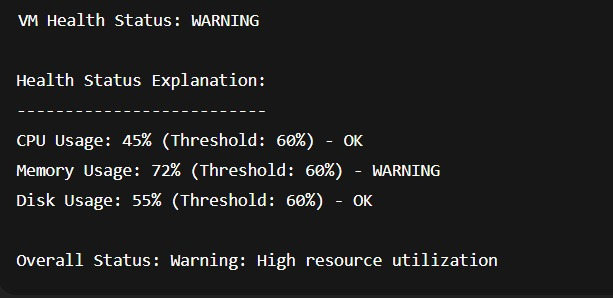

# Enhanced VM Health Check

A beginner-friendly, automated health monitoring solution for your Linux (Ubuntu) virtual machines. This project helps you keep track of CPU, memory, and disk usage, sends notifications if something goes wrong, and can be set up to run automatically.

---

## Table of Contents
- [Features](#features)
- [How It Works](#how-it-works)
- [Quick Start](#quick-start)
- [Sample Output](#sample-output)
- [Configuration](#configuration)
- [Automation & Notifications](#automation--notifications)
- [Troubleshooting](#troubleshooting)
- [FAQ](#faq)
- [License](#license)

---

## Features
- **Monitors** CPU, memory, and disk usage
- **Customizable thresholds** for warnings and critical alerts
- **Automatic logging** of health checks
- **AWS SNS notifications** for alerts (optional)
- **Easy automation** with cron jobs
- **Beginner-friendly setup script**

---

## How It Works
1. The main script (`enhanced_vm_health_check.sh`) checks your VM's health.
2. If any resource (CPU, memory, disk) is over the set threshold, it logs a warning or critical alert.
3. If enabled, it sends a notification to your email or phone using AWS SNS.
4. You can automate these checks to run every few minutes using cron jobs.

---

## Quick Start

### 1. Download the Files
- `enhanced_vm_health_check.sh` — Main health check script
- `setup_vm_health_automation.sh` — Easy setup script
- `vm_health_check.conf` — Configuration file example

### 2. Make Scripts Executable
```bash
chmod +x enhanced_vm_health_check.sh setup_vm_health_automation.sh
```

### 3. Run the Setup Script (Recommended)
```bash
sudo ./setup_vm_health_automation.sh
```
- This will guide you through installing dependencies, setting up configuration, enabling notifications, and automating checks.

### 4. Run a Manual Health Check
```bash
./enhanced_vm_health_check.sh explain
```

---

## Sample Output

Below is an example of the script's output when a warning is detected:



---

## Configuration

The configuration file (`/etc/vm_health_check.conf`) lets you set thresholds and notification options. Example:

```ini
# /etc/vm_health_check.conf
CPU_THRESHOLD=60
MEMORY_THRESHOLD=60
DISK_THRESHOLD=60
SNS_TOPIC_ARN="arn:aws:sns:us-east-1:123456789012:vm-health-alerts"
AWS_REGION="us-east-1"
LOG_FILE="/var/log/vm_health_check.log"
```

- **Thresholds:** Set the percentage at which you want to be warned or alerted.
- **SNS_TOPIC_ARN:** (Optional) Set up AWS SNS to receive notifications.
- **LOG_FILE:** Where logs are saved.

---

## Automation & Notifications

### Automate Health Checks
- The setup script can add a cron job to run the health check every 5, 15, or 60 minutes (or a custom interval).
- You can also add it manually:
  ```bash
  crontab -e
  # Add this line to run every 5 minutes:
  */5 * * * * /path/to/enhanced_vm_health_check.sh --silent --notify
  ```

### Enable AWS SNS Notifications
- Make sure you have the AWS CLI installed and configured (`aws configure`).
- Enter your SNS topic ARN in the config file or during setup.
- The script will send alerts if your VM is unhealthy.

---

## Troubleshooting
- **Script not running?** Make sure it is executable (`chmod +x ...`).
- **No notifications?** Check your AWS CLI setup and SNS topic ARN.
- **No logs?** Ensure the log file path is writable (default: `/var/log/vm_health_check.log`).
- **Permission errors?** Run scripts with `sudo` if needed.

---

## FAQ
**Q: Do I need to know Bash scripting?**  
A: No! The setup script guides you through everything.

**Q: Can I use this on any Linux VM?**  
A: It is designed for Ubuntu/Debian, but may work on other distributions with minor tweaks.

**Q: Is AWS SNS required?**  
A: No, it's optional. You can use the script without notifications.

**Q: How do I change thresholds later?**  
A: Edit `/etc/vm_health_check.conf` and update the values.

---

## License
MIT License

---

*Created for easy, reliable VM health monitoring. Beginners welcome!*
